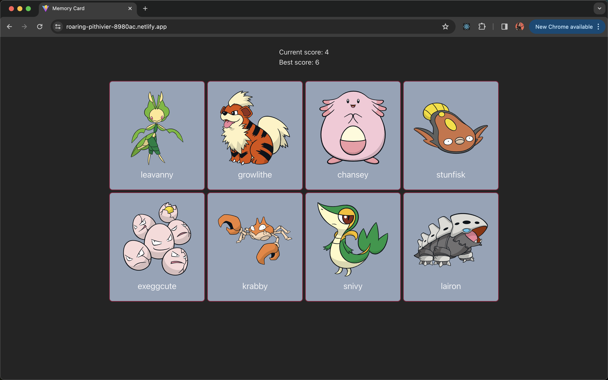

# Memory Card

This is a memory card game which I developed to better my react and api skills.

## Table of Contents

- [Demo](#demo)
- [Technologies](#technologies-used)
- [How To Play](#how-to-play)
- [Contributing](#contributing)
- [License](#license)

## Demo

You can view the app at [Memory Card Demo](https://roaring-pithivier-8980ac.netlify.app/).

## Technologies Used

- React
- Javascript
- Tailwind CSS
- PokeAPI

## How To Play

- Select pokemons which you have not selected previously

## Contributing

Contributions are welcome! If you'd like to contribute to this project, please follow these guidelines:

1.  Fork the repository.
2.  Create a new branch for your feature or bug fix.
3.  Make your changes and commit them.
4.  Push your changes to your fork.
5.  Create a pull request.

## License

This project is licensed under the [MIT LICENSE](./LICENSE)
